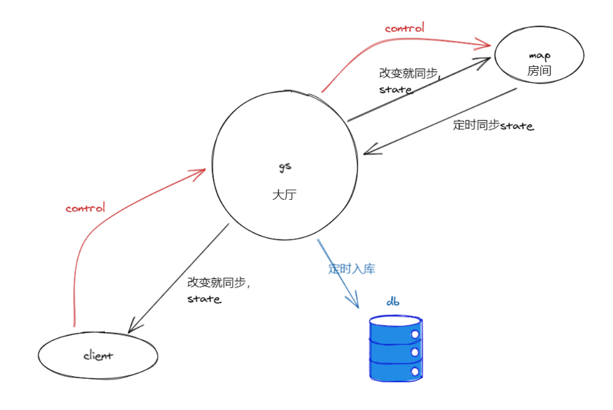
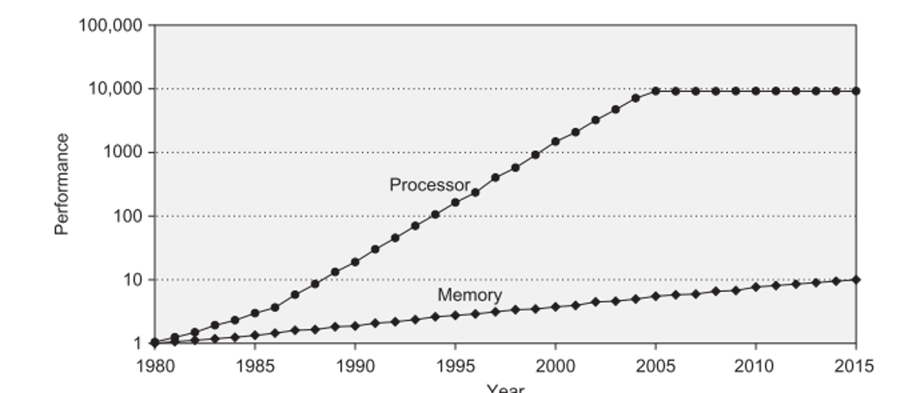
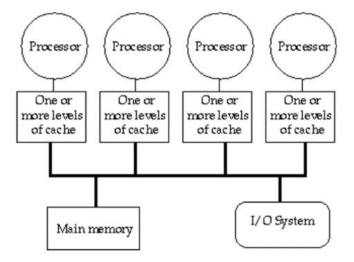

* TOC
{:toc}

# Zeze-游戏服务器架构

## 本质复杂度

> All software construction involves **essential tasks**,  the fashioning of the complex conceptual structures 
> that compose the abstract software entity, and **accidental tasks**, the representation  of these abstract entities
> in programming languages and the mapping of these onto machine languages within space and speed constraints.

以上引用自 小弗雷德雷克·布鲁克斯 的《没有银弹，软体工程的本质性与附属性工作》。

软件设计与开发的核心就在于**控制复杂度**，而复杂度主要可分为两种：**本质性的**和**附属性的**。本质复杂度和待求解问题的本质有关，是无法避免的。

附属性的复杂度则是电脑软件开发过程中所引入不必要的复杂度。偶然复杂度不是待求解问题的本质。
是我们的程序代码结构，是代码设计，是代码函数写法，变量命名，是我们一遍一遍做同样的事，一遍一遍做相同结构的构建，
是我们的框架，是多线程、多进程通讯等底层体系架构的约束，等等带来的。

以下我会分析探讨游戏服务器框架，在探讨的过程中，大家去分辨哪些是本质复杂度，哪些是附属性的。
在自己的项目框架中本质复杂度占多少，附属性的复杂度占多少？哪些附属性的复杂度可以被去除？


## 游戏数据流向和上下文



以上为一个从数据角度出发的游戏流向模型，这也是xx手游的模型。
客户端发控制信号control给服务器，服务器改变状态state后，再通知给客户端，服务器定时入库存储状态。
这里区分了两个不同的概念：

* 大厅（gs，game server）
* 房间（map）。

因为我们可以把control和state分为两类：

* 跟全局数据交互，一般不需要广播给同场景周围人的，比如A请求加B好友，A加入帮派，帮派成员列表信息同步。
* 跟场景局部数据交互，一般需要广播给周围人的，比如A移动，A使用技能，B血量同步。

两者的区别，导致需要两种不同的上下文context：

* 数据库里所有的数据
* 场景内的状态数据

至于gs跟map是否同一个进程，一组服务器能否有多个gs，如果map是分开的进程，是否支持多个map，这些都不是这里我们概念上考虑的问题。

这篇文章将只讨论第一类，也就是大厅gs的架构问题。

## 例子

我们用一个具体的例子来讨论gs。这个例子涉及两个对象A、B，需要4个步骤的。这4个步骤如下

    1. checkA
    2. doA
    3. checkB
    4. doB

比如：A请求加B好友

    checkA：A还有好友位，A.friends().size()  < 100
    doA：加B到A的好友列表中 A.friends().add(B.id)
    checkB
    doB

比如：A加入帮派B

    checkA：检查A没有在其他帮派
    doA：设置A帮派id为B.id
    checkB：B成员数量没满，B里没有成员是A的敌人
    doB：加A到B帮派成员列表里

我们用A请求加B好友这个例子， 这个例子的本质复杂度的代码如下：

```lua
A = xtable.friends.get(Aid)
B = xtable.friends.get(Bid)
if (A.friends.size() < 100 and B.friends.size() < 100) then
  A.friends.add(Bid)
  B.friends.add(Aid)
end
```

## 最原始的web程序怎么写？

```lua
local function process_add_friend(aid, bid)
    sql.begintx()
    a, b = sql.execute("select * from friends where id in (aid,bid) for update")
    if a.friendcnt > 100 then
        return
    end
    if b.friendcnt > 100 then
        return
    end
    sql.execute("update friends = xxx  where id = aid")
    sql.execute("update friends = xxx  where id = bid")
    sql.endtx()
end
```

note：此文里的代码大多是如上所示的类lua的伪代码，sql.begintx()，是begin transaction的含义

* 按协议请求为粒度来做并发，request-level parallelism
* 直接用sql来访问数据，这里要关注两个细节
* for update

    MySQL innodb默认事务隔离度是repeated read，如果select没有加for update，那它会是个快照读，不会加读锁。
    这是为了利用mvcc，让这行在被write时仍然能被read，增加并发度。
    
    如果不加for update则后面sql.execute更新时，可能a，b的friendcnt字段已经被别的请求修改，
    之前的检测a.friendcnt>100已经失效，不一定再能检测通过了。

* in (aid, bid)

    不能分成两句，`select * from friends where id=[aid] for update`; 
    `select * from friends where id=[bid] for update`。

    如果此刻B同时在加A为好友，
    - 当A线程执行` select * from friends where id=[aid] for update` 之后，`select * from friends where id=[bid] for update`前。
    - B线程执行完了` select * from friends where id=[bid] for update` 
  
    此时就死锁了。因为A线程持有aid对应的锁，等待得到bid对应的锁，B线程持有bid锁，等待aid锁，形成环，导致死锁。

    写到一个in里，mysql会给你排序。就避免了这种情况下的死锁。（当然你可以进一步想，这里正好需要从同一个table中去区两行信息，mysql正好提供了in语法来避免死锁，
    要是需要从不同table中获得信息怎么办呢）


## 用memcache的Web程序


```lua
local function load_user()
    sqlcmd = "SELECT * FROM user WHERE user_id =?"
    key = 'SQL:user.'.. user_id
    result = memcli.get(key)
    if result then
        return result
    else
        res = sql.execute(sqlcmd, user_id)  // <1>
        memcli.set(key, res, 5 * 60)        // <4>
        return res
    end
end

local function update_user(userid, name)
    sqlcmd = "UPDATE name=? FROM user WHERE user_id =?"
    key = 'SQL:user.'.. user_id
    res = sql.execute(sqlcmd, name, user_id) // <2>
    memcli.delete(key)                       // <3>
    return res
end
```

原始的web程序，直接访问mysql数据库，可能会导致数据库的访问瓶颈，web上一般会使用memcache来做cache，减少到数据库的访问。以上展示的就是用户信息的读写例子。
这里其实有一致性问题。也许web并不需要那么讲究，只要出现问题的概率非常低就性，同时cache加上失效时间，就算不一致了，后面还有机会一致。

这里update有技巧：是先execute sql，然后invalidate cache，不先invalidate cache，不write to cache。减少了出概率的问题。
（但代码里1234的并发序列还会出问题，只是这种可能行比较低）

以上说明了引入cache后，单个record并发访问都有问题，更不用说涉及多个record之间交互的一致性了。

## 一个卡牌手游服务器

1. 启动一个Cache线程， 定期20分钟一次savePlayerInfo刷到数据库
2. login时读getDbPlayerInfo到cache
3. 实际用的时候比如AddFriend，从Cache里读，如果A，B不在就堵塞直接从数据库里读。
4. 只在Cache这一层用了个ConcurrentHashMap，但得到PlayerInfo后没有锁，可能会导致数据不一致的。比如连续自己2个AddFriend， 
因为没锁，2个checkAdd都可能通过我，那自己AddFriend就超过好友数上限了。运气好，负载不重可能不太会出错。


## 并发：两大范式

以上的三种程序，是从web方式演化来的，是符合直觉的，并发是request为粒度做的，context是整个数据库，跟我们在游戏数据流向和上下文 一节分析的概念模型一致。
程序代码也比较直接，是同步直接写。引入的附属性复杂度为
* 组织sql语句，然后转换成代码对象
* 需要考虑锁的情况
* 为效率需要考虑cache的使用，要考虑cache的一致性问题

也许你熟悉golang的一个设计哲学：
> Do not communicate by sharing memory; instead, share memory by communicating.
> 

以上三种web方式的程序做法，使用sharing memory做通讯，我们称之为并发的第一种范式，那第二种范式就是使用message-passing做通讯的Actor model。
以下我们来看实际的例子，都是实际上线项目的做法。


## skynet服务器

skynet是云风开源的一个游戏服务器框架，是一个典型的actor model，我们也有项目在使用，以下是使用的方式

```lua
function Agent:check_friends()
    return self.friends.size() > 100
end
function Agent:add_friend(id)
    return self.friends.add(id)
end

local aOk = A:check_friends()
if not aOk then
    return
end
B = skynet.call(agentmgr, "get_agent", { agentid = Bid })
local bOk = skynet.call(B, "check_friends", {})
if not bOk then
    return
end

A:add_friend(Bid)
skynet.call(B, "add_friend", { id = Aid })
```

* 以单个玩家为actor，作为并发的粒度，以单个玩家的数据为context，选用阻塞方式

* skynet.call是会阻塞等待响应，这是个coroutine

* get_agent Bid如果Bid不在线，这里底层agentmgr会加载数据制作一个agent返回，在不在线都统一处理

* bOk返回后 aOk代表的A:check_friends是不是还成立就不一定了，这里容忍了这种不一致

* 还有其他类型的actor，比如所有的帮派应该是个actor，每个scene应该是个actor。


## java游戏服务器

```lua
function Agent:onLogin()
    for _, todo in ipairs(self.todo) do
        handle(todo)
    end
end

local function send_msg(id, msgtype, msgcontent)
    local b = get(id)
    if b then
        sendto_scene_then_bscene_handle({msgtype, msgcontent})
    else
        sendto_todoscene_then_mktodo({msgtype, msgcontent})
    end
end

local aOk = A:check_friends()
if not aOk then
    return
end

send_msg(Bid, msgtype: "request_add_friend", msgcontent: {id = Aid})
```

* 以单个场景为actor，作为并发的力度，以这个场景内所有玩家，所有npc的数据为context，选用非阻塞方式

* send_msg不阻塞，相当于使用skynet.send。

具体流程描述如下：

1. A所在场景线程收到协议request后，check A，发msg1给B所在场景线程。
2. B所在场景线程收到msg1，做check B，do B的工作，然后再发另一个msg2给A所在场景线程。
3. A所在场景线程收到msg2，做do A工作。

以上如果B不在线，或者B发msg2时A不在线的话，msg会被存到db的todo队列里，下次b，a上线时再做，伪代码里的sendto_todoscene_then_mktodo是实现细节。

* 跟上一个例子一样的不一致风险，并且因为这里存在等B上线才做check B，时间窗口更长，这个不一致风险更大。这里要怎么解决？

   很可能因为这里的技术细节，决定了要影响业务逻辑，当check A之后，A要预留一个好友空位，引入状态： 等待加B为好友。。。


## 从同步到异步

以上两种做法我们称作异步，因为跟之前web方式的同步做法不同，业务逻辑因为技术选择被拆成了多个部分，在多个时间点执行。
这引入的额外的消息定义，传输。引入额外的数据一致性如何保证的问题，这个一致性问题非常难以解决，要么我们忽略，
要么我们把他变成业务问题，在业务层级（也就是策划）就需要知道，策划文档变的复杂，代码变的破碎，玩家理解也变得困难。
即使这样不一致仍然可能发生，需要指定策略来缓解此问题，这边制定的一个策略是*先扣后给*，如果中间有错误，
因为玩家利益受损会找客服要求补偿，不容易造成玩家发现漏洞不反馈客服反复刷的问题。

（除了以上说的业务代码被分出多份在多个时间点执行导致的不一致外，还有数据定期db存储导致的不一致，
以上因为没有引入事务，所以存储的时候都是以一个player的数据为边界来存的，如果2个player交互，则崩溃时可能出现A存了，B没存。）

怎么办？

让我们回归初心，看看web方案，其实是比较直接的，只要用框架代码解决了前文我所述的附属性复杂度，程序员只要写解决本质复杂度的代码就行了。

其实因为性能从同步到异步，再因为代码编写方便回归同步，这样的螺旋式进步是很正常的，注意这里的回归同步是同时保留了从同步到异步的性能，又代码编写方便。
* 我在《逻辑层的异步加载处理策略》文中描述了xx手游客户端的资源加载的这个过程。
* 通用编程从操作系统同步io的api，到epoll的异步编程，再到c#的async await的回归同步，再到java的virtual thread的更彻底的回归，也能看到这个过程。

## xdb的方案

2007年的时候，lch开始做游戏，就用java写了个xdb，在程序中支持事务，用同步的方式写逻辑，很多项目开始用这个框架来开发，xx手游也是用这个框架做的

```xml
<bean name="friendinfo">
    <var name="friends" type="set,int"/>
</bean>
<table name="friends" key="int" value="friendinfo"/>
```

```lua
locks(xtable.friends, Aid, Bid)
A = xtable.friends.get(Aid)
B = xtable.friends.get(Bid)
if (A.friends.size() < 100 and B.friends.size() < 100) then
    A.friends.add(Bid)
    B.friends.add(Aid)
end
```

* 在xml中定义db的schema，然后会生成对应的代码，
* `xtable.friends.get(Aid)` ：锁住friends表的Aid这一行，在cache中查询如果在则直接返回，否则从数据库里同步加载此行数据放入cache并返回
* 整个执行被包含在一个事务中，并且落地到db中也是以事务为边界（不是单个player数据为边界），所以异常，崩溃都不会影响数据的一致性。
 
* `locks(xtable.friends, Aid, Bid)` 行锁粒度，要实现锁住Aid，Bid这两行，避免死锁。这是附属性复杂度

## 性能分析

跟web方案一样的，xdb方案当`xtable.friends.get(Aid)`，当Aid被其他线程持有时lock会让线程等待，当Aid对应的行不在cache中是，需要有一个同步的io过程，会让线程等待，
而线程作为系统资源又不能开很多，从而会影响整个系统的吞吐率。针对这个顾虑我们可以类比cpu的cache

我们可以写个程序测试一下哈希表查询和SQL查询差的差距。

结论如下：map query比sql query快1000倍，map update比sql update快1000倍
（100倍是设置Innodb_flush_log_at_trx_commit=0，也即每1秒flush事务到disk上；如果用默认每个事务都flush disk，则map update比sql update快5000倍）





* Gs 上在memory中的cache 对应 cpu cache
* Gs 数据库 对应 memory

* 速度都是相差了1000倍
* Cpu也是如果load发现不在cache中，也会stall，等待memory返回数据

通过对比我们发现xdb这个同步io读的cache策略跟cpu的memory访问策略是一致的，cpu可以忍受cache miss时的stall，我们也可以。只要cache hit的比率足够大，
cache hit一般的都是超过99%的。并且根据我们 游戏数据流向和上下文 一节的讨论，我们只处理“大厅”内的事务，频率很高的移动，释放技能我们并不在这个框架下处理，
事务基本都对应于玩家做为人的操作动作，所以所需的吞吐率不会太高。

何况现在java21 支持了虚拟线程 virtual thread，当你lock被其他线程持有时，
当同步io时，并不会真正让操作系统的carrier thread等待，从而带来跟异步方案同样的性能。


## 解决锁这个附属性复杂度

```lua
locks(xtable.friends, Aid, Bid)

A = xtable.friends.get(Aid)
B = xtable.friends.get(Bid)
if (A.friends.size() < 100 and B.friends.size() < 100) then
  A.friends.add(Bid)
  B.friends.add(Aid)
end
```

- 我们隐藏了 SQL
- 隐藏了用于提高性能的 Cache
- 但还没隐藏掉锁


如代码所示的`locks(xtable.friends, Aid, Bid)`是可以不要的，因为`xtable.friends.get`函数会去lock对应的行。
就是说没有预先的locks，整个程序的正确性是保证的，但死锁的概率比较大，虽然xdb框架有死锁自动检测，自动打断重做机制，但这会影响系统事务的吞吐率。

所以xx的使用策略就是告知xdb我要访问的所有的行，让xdb对这些行锁预先排序，避免死锁。
当然这个也没办法完美的预先排序，因为总有些信息是需要访问数据库后才能知道所有的行，比如加入帮派，

1. 先`B = Xtable.factions.select(bid)`取到B后，注意这里用select，不会持有锁。
2. 然后统一来排序加锁`locks(xtable.factions, (bid), xtable.roleinfos, (aid, B.members))`
这里不但需要锁住帮派表factions的这一行，还需要锁住帮派里所有的成员roleinfos表的对应行
3. 然后再写业务逻辑

这样锁之后再做，虽然仍然可能死锁（在select和locks之间新的玩家加入此帮派），但概率很低了。此时依赖框架的死锁检测打断重做机制。


能不能彻底的隐藏掉这个附属性复杂度，程序员只写后面必须写的，只处理本质复杂度？


## 从悲观锁到乐观锁

这是lch在xdb概念的基础上，开始写zeze框架的一个重要的原因，用乐观锁机制为逻辑程序员去掉这个附属性复杂度。

1. 事务执行过程中不加锁，所有修改仅当前事务可见。提交的时候对所有访问的记录排序 并且加锁并进行冲突检查。
如果每条记录的Timestamp没有变化，这是大概率事件，特别是涉及到单个用户行为的时候，则直接执行成功。
2. 如果有记录的Timestamp发生变化，也就是冲突，则重做事务。冲突重做时保持已经得到的锁，这样在冲突非常严重时，第二次执行事务一般都能成功，而
   不会陷入一直冲突，事务永远没法完成的情况。

但这并不是zeze唯一要解决的问题。

我们放弃了actor model回到了同步方式，但那是在单组服务器上，如果我们需要跨服交易，跨服好友，这些怎么办？我们又退回到actor model，
只是这次是整个服务器作为一个actor，用异步来写跨服逻辑。上文所写到的引入的复杂度，引入的一致性问题又会出现。

## 跨服功能和单服一样同步来写

```lua
A = xtable.friends.get(Aid)
B = xtable.friends.get(Bid)
if (A.friends.size() < 100 and B.friends.size() < 100) then
  A.friends.add(Bid)
  B.friends.add(Aid)
end
```

以上A，B属于不同的服务器，要加好友，代码跟单服一模一样，就如上所示。这就是zeze框架要达到的目标。

同样类比cpu对内存的访问



1. 全服接入同一个db，db类比于上图的main memory
2. 每个gs类比于上图中的一个processor

cpu是怎么解决cache之间的同步的？有两种方案
* Bus Snooping Solution
* Directory-based cache coherence

cpu core数量>8时 第一种基于bus的方案，对bus的竞争会激烈，放弃。
zeze选择第二种。zeze里的GlobalCacheManager就对应这里的Directory，里面保存记录record被谁own，被谁share这些信息。
每当`xtable.friends.get(Aid)`时，可能会需要跟这个Directory通讯获得权限。通过这种方式zeze支持了分布式事务。

下一个是GlobalCacheManager是个单点，怎么办？zeze也引入了raft算法解决了单点问题。


## 总结

以上从复杂度的分析出发，从例子出发，从各游戏服务器比较分析出发，从同步到异步再回归同步的角度出发，从数据一致性的角度出发，
总结了我认为的gs游戏服务器开发的一些核心问题，这些问题怎么引导出了zeze这个框架。


